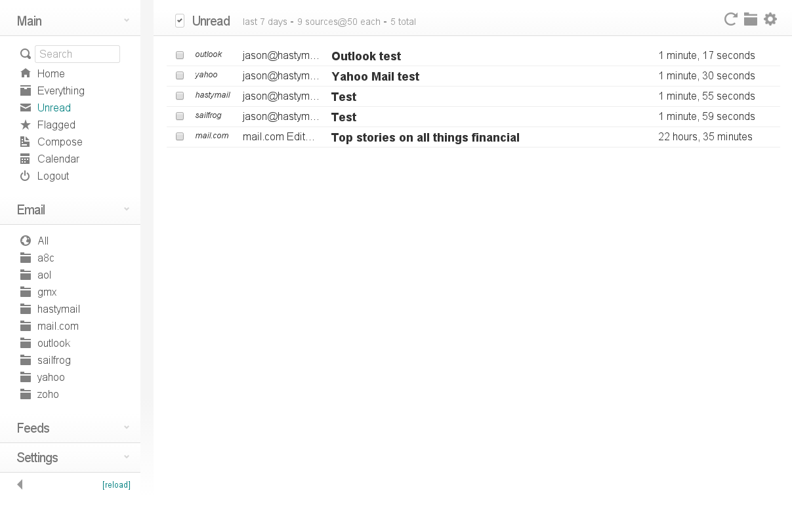

<!--
N.B.: This README was automatically generated by https://github.com/YunoHost/apps/tree/master/tools/README-generator
It shall NOT be edited by hand.
-->

# Cypht for YunoHost

[](https://dash.yunohost.org/appci/app/cypht)  

[](https://install-app.yunohost.org/?app=cypht)

*[Lire ce readme en français.](./README_fr.md)*

> *This package allows you to install Cypht quickly and simply on a YunoHost server.
If you don't have YunoHost, please consult [the guide](https://yunohost.org/#/install) to learn how to install it.*

## Overview

All your E-mail, from all your accounts, in one place. Cypht is not your father's webmail. Unless you are one of my daughters, in which case it is your father's webmail. Cypht is like a news reader, but for E-mail. Cypht does not replace your existing accounts - it combines them into one. And it's also a news reader.

Cypht is an application built entirely of plugins, or as we call them, module sets (which is obviously way cooler sounding than plugins), that are executed by the framework. Modules provide a flexible way to add new features or customize the program without hacking the code.


**Shipped version:** 1.3.2023.06.12~ynh6

## Screenshots



## Documentation and resources

* Official app website: <https://cypht.org>
* Official admin documentation: <https://cypht.org/install.html>
* Upstream app code repository: <https://github.com/jasonmunro/cypht>
* YunoHost documentation for this app: <https://yunohost.org/app_cypht>
* Report a bug: <https://github.com/YunoHost-Apps/cypht_ynh/issues>

## Developer info

Please send your pull request to the [testing branch](https://github.com/YunoHost-Apps/cypht_ynh/tree/testing).

To try the testing branch, please proceed like that.

``` bash
sudo yunohost app install https://github.com/YunoHost-Apps/cypht_ynh/tree/testing --debug
or
sudo yunohost app upgrade cypht -u https://github.com/YunoHost-Apps/cypht_ynh/tree/testing --debug
```

**More info regarding app packaging:** <https://yunohost.org/packaging_apps>
