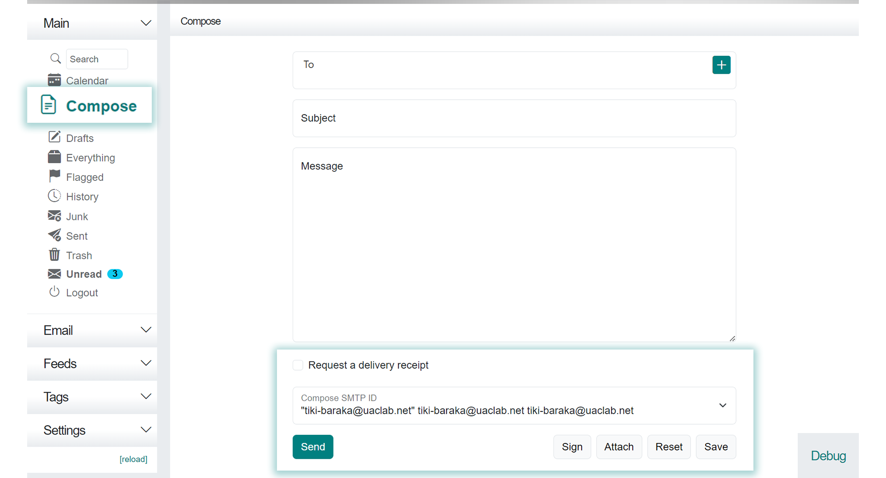

<!--
Ohart ongi: README hau automatikoki sortu da <https://github.com/YunoHost/apps/tree/master/tools/readme_generator>ri esker
EZ editatu eskuz.
-->

# Cypht YunoHost-erako

[](https://ci-apps.yunohost.org/ci/apps/cypht/)


[](https://install-app.yunohost.org/?app=cypht)

*[Irakurri README hau beste hizkuntzatan.](./ALL_README.md)*

> *Pakete honek Cypht YunoHost zerbitzari batean azkar eta zailtasunik gabe instalatzea ahalbidetzen dizu.*  
> *YunoHost ez baduzu, kontsultatu [gida](https://yunohost.org/install) nola instalatu ikasteko.*

## Aurreikuspena

All your e-mail, from all your accounts, in one place. Cypht is not your father's webmail. Unless you are one of my daughters, in which case it is your father's webmail. Cypht is like a news reader, but for e-mail. Cypht does not replace your existing accounts - it combines them into one. And it's also a news reader.

Cypht is an application built entirely of plugins, or as we call them, module sets (which is obviously way cooler sounding than plugins), that are executed by the framework. Modules provide a flexible way to add new features or customize the program without hacking the code.


**Paketatutako bertsioa:** 2.4.0~ynh1

## Pantaila-argazkiak



## Dokumentazioa eta baliabideak

- Aplikazioaren webgune ofiziala: <https://cypht.org>
- Administratzaileen dokumentazio ofiziala: <https://cypht.org/install.html>
- Jatorrizko aplikazioaren kode-gordailua: <https://github.com/cypht-org/cypht>
- YunoHost Denda: <https://apps.yunohost.org/app/cypht>
- Eman errore baten berri: <https://github.com/YunoHost-Apps/cypht_ynh/issues>

## Garatzaileentzako informazioa

Bidali `pull request`a [`testing` abarrera](https://github.com/YunoHost-Apps/cypht_ynh/tree/testing).

`testing` abarra probatzeko, honakoa egin:

```bash
sudo yunohost app install https://github.com/YunoHost-Apps/cypht_ynh/tree/testing --debug
edo
sudo yunohost app upgrade cypht -u https://github.com/YunoHost-Apps/cypht_ynh/tree/testing --debug
```

**Informazio gehiago aplikazioaren paketatzeari buruz:** <https://yunohost.org/packaging_apps>
